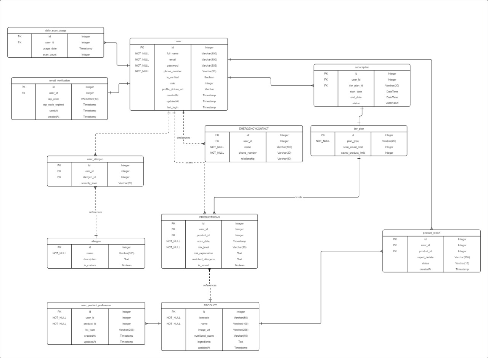

# 📱 Allertify – Know What You're Biting Into  

**Allertify** is a mobile app that helps people with food allergies make safer choices when buying or consuming packaged products.  
Using **barcode scanning, AI-powered allergy reasoning, and personalized profiles**, the app provides instant product risk analysis, clear categorization, and emergency assistance features.  

## ⚙️ Developers
### Front-end
1. [Ausath Ikram](https://github.com/ausathdzil)
2. [Maria Amanda Devina](https://github.com/marimoria)

### Back-end
1. [Arvan Yudhistia Ardana](https://github.com/arvardy184)
2. [Muchammad Rafif Azis Syahlevi](https://github.com/rafifazs20)

## 🖼️ Project Overview
### Use Case Diagram


### Entity Relationship Diagram (ERD)

[Miro board](https://miro.com/app/live-embed/uXjVJV8BZn4=/?focusWidget=3458764637279385595&embedMode=view_only_without_ui&embedId=658504284852)

### System Design Diagram


### CI/CD Diagram


### Tech Stack  

- **Frontend (Mobile):** React Native (Expo)  
- **Backend:** Express.js + PostgreSQL (Prisma ORM)  
- **Auth:** JWT + Argon2 password hashing  
- **AI:** Gemini API (Vercel AI SDK)  
- **Product Data:** Open Food Facts API  
- **CI/CD:** GitHub Actions / Jenkins + Docker + VPS Deployment  
- **Testing:** Jest (unit & integration)  

## ✨ Features  
### 👤 User Registration & Onboarding  
- Secure sign-up with email, password, phone number, and OTP verification.  
- Create a personalized allergy profile (preset or custom).  
- Add/manage emergency contacts.  

### 🏠 Home Dashboard  
- Quick access to product scanning.  
- Recent scans with allergy risk indicators.  
- Saved product previews (Safe ✅ / Unsafe ❌).  
- Emergency call button.  
- Subscription tier status (Free or Premium).  

### 🔍 Product Scanning & Analysis  
- **Barcode scanning** powered by [Open Food Facts API](https://world.openfoodfacts.org/).  
- **AI-powered reasoning** with Gemini API (via Vercel AI SDK).  
- Displays:  
  - Risk level (Low, Medium, High).  
  - Allergen matches.  
  - Nutritional info & short explanation.  
- Auto-saves products into **Green (Safe)** or **Red (Unsafe)** lists.  

### 📂 Saved Product Lists  
- View all scanned products.  
- Search by product name.  
- Tabs: Green ✅ (Safe) & Red ❌ (Unsafe).  
- Detailed product pages (ingredients, risk, nutrition).  

### 🚨 Emergency Action  
- One-tap emergency button with confirmation.  
- Auto-calls your emergency contact.  

### 💳 Subscription Plans  
- **Free:** Limited scans per day, unlimited saved products.  
- **Premium:** Unlimited scans.
- Mock upgrade/cancel system (no real payments).

## 📊 Non-Functional Requirements  

- **Performance:**
  - Barcode scan + allergy analysis result should be returned within < 5 seconds on a stable 4G connection
  - Emergency action triggers should respond within < 2 seconds after confirmation.

- **Availability:**
  - System uptime target of 99.5% for back-end services during operational hours.

- **Scalability:**
  - Backend should support scaling to 10x current user load without major architectural changes.
  - Database queries optimized with proper indexing for product and user data.

- **Security:**
  - All API communication is encrypted with HTTPS.
  - Password stored with hashing (Argon2).
  - JWT-based authentication with role-based access control.

## 🚫 Out of Scope (v1.0 Release)  

- There will be no IOS support built in this release.
- No new allergy reasoning models will be trained or fine-tuned. Allergy score prediction and product analysis will rely on a pre-trained model via the Vercel AI SDK (Gemini).
- Product information and allergen analysis will only be retrieved from the Open Food Facts API. No integration with other databases is planned.
- The native mobile app will not include admin dashboard functionality.
- Barcode scanning, OCR, and allergy reasoning will require an active and stable internet connection. No offline mode or local-only analysis is supported in this release.
- This release will not implement real monetary transactions or integration with payment gateways. Tier purchases will operate through a mock system for demonstration purposes only, with no actual - funds transferred.
- There will be no UI/UX support for desktop or tablet devices.
- The application will not verify the accuracy of the user’s allergy profile or medical condition. The system relies entirely on self-reported information provided by the user.
- There will be no support for SMS or WhatsApp based OTP, only Email will be supported. 

## 🚀 Getting Started
```bash
# 1. Clone repository
git clone https://github.com/Allertify/allertify-mobile.git
cd allertify

# 2. Edit .env.local
EXPO_PUBLIC_API_BASE_URL= https://allertify.ciet.site/api/v1

# 3. Install dependencies
npm install

# 4. Install Expo-Go di playstore

# 5. Start mobile app
npx expo start

# 6. Switch to expo-go (click s di terminal)

# 7. Scan barcode
```